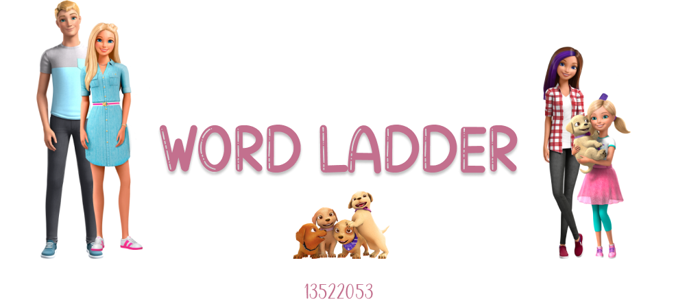

<h1 align="center"> Tugas Kecil 3 IF2211 Strategi Algoritma </h1>
<h1 align="center">  Penyelesaian Permainan Word Ladder Menggunakan Algoritma UCS, Greedy Best First Search, dan A* </h1>




## Table of Contents
1. [General Information](#general-information)
2. [Contributors](#contributors)
3. [Features](#features)
4. [Requirements Program](#required_program)
5. [How to Run The Program](#how-to-run-the-program)
6. [Project Status](#project-status)
7. [Project Structure](#project-structure)
8. [Screenshots](#screenshots)


## General Information
Word ladder (also known as Doublets, word-links, change-the-word puzzles, paragrams, laddergrams, or word golf) is a well-known word game enjoyed by all ages. The game was invented in 1877 by Lewis Carroll, a writer and mathematician. In the game, players are given two words: a starting word and an ending word. To win, they must find a chain of words linking the start and end words. Both words always have the same number of letters. Each consecutive word in the chain may differ by only one letter. The goal is to find the optimal solution, which minimizes the number of words included in the chain.
There's three algorithm that user can use for playing the Word Ladder using this program. The first algorithm is Uniform Cost Search (UCS) where the formation of a path word ladder uses a priority queue to store the value g(n), namely the cost from root to node n in order from smallest. The second algorithm is Greedy Best First Search (GBFS) where the formation of a path word ladder uses a priority queue to store the heuristic value h(n), namely the estimated cost from node n to the destination node in order from the smallest. The last algorithm is A* where the formation of a path word ladder uses a priority queue to store the heuristic value f(n) which is the sum of g(n) and h(n) as has been explained that g(n) is the cost from the root to node n and h(n) is the estimated cost from node n to the destination node. The f(n) values are ordered from the smallest.


## Contributors
|   NIM    |                  Nama                  |
| :------: | :------------------------------------: |
| 13522053 |       Erdianti Wiga Putri Andini       |


## Features
Features that used in this program are:
| NO  | Algorithm   | Description                                                                       |
|:---:|-------------|-----------------------------------------------------------------------------------|
| 1   | UCS         | WordLadder searching the most optimum path using Uniform Cost Search algorithm    |
| 2   | GreedyBFS   | WikiRace searching the path using Greedy Best First Search algorithm              |
| 3   | A*          | WikiRace searching the path using A* algorithm                                    |


## Requirements Program
|   NO   |  Required Program                  |                           Reference Link                            |
| :----: | ---------------------------------- |---------------------------------------------------------------------|
|   1    | Java                               | [Java](https://www.java.com/en/download/)                           |                            
|   2    | Java Swing                         | -                                                                   |
|   3    | Java Kit                           | [Java Kit](https://www.oracle.com/java/technologies/downloads/)     |


## How to Run The Program
### CLI Based
1. Clone this repository by typing `git clone https://github.com/wigaandini/Tucil3_13522053.git` in terminal.
2. Open the repository folder.
3. If you're using Windows, type `./run-CLI.bat` in terminal.
4. If you're using Linux, type `chmod +x run-CLI.sh` in terminal then type `./run-CLI.sh`.
5. Input the start word and end word.
6. Choose the algorithm by typing `UCS` / `GBFS` / `A*`/ `BFS`.
7. Wait and the result will appear.

### GUI Based
1. Clone this repository by typing `git clone https://github.com/wigaandini/Tucil3_13522053.git` in terminal.
2. Open the repository folder.
3. If you're using Windows, type `./run-GUI.bat` in terminal.
4. If you're using Linux, type `chmod +x run-GUI.sh` in terminal then type `./run-GUI.sh`.
5. Input the start word and end word.
6. Choose the algorithm in the box.
7. Click the `Search!` button.
8. Wait and the result will appear.


## Project Status
This project has been completed and can be executed.


## Project Structure
```bash

│
├── README.md
│
│  
├── bin                         # Executable files
│    ├── AStar.class
│    ├── AStarNode.class
│    ├── BFS.class
│    ├── BFS$Node.class
│    ├── dictionary.txt
│    ├── DictionaryLoader.class
│    ├── GreedyBFS.class
│    ├── GreedyBFS$Node.class
│    ├── Main.class
│    ├── Node.class
│    ├── SearchResult.class
│    ├── UCS.class
│    ├── Utils.class
│    ├── WordLadderException.class
│    ├── WordLadderGUI.class
│    └── WordLadderGUI$1.class
│  
│  
├── doc/                        # Document files
│    └── Tucil3_13522053.pdf
│
│  
├── src/                        # Source code files
│    ├── AStar.java
│    ├── AStarNode.java
│    ├── BFS.java
│    ├── dictionary.txt
│    ├── DictionaryLoader.java
│    ├── GreedyBFS.java
│    ├── Main.java
│    ├── Node.java
│    ├── SearchResult.java
│    ├── UCS.java
│    ├── Utils.java
│    ├── WordLadderException.java
│    └── WordLadderGUI.java 
│
│
├── test/                        # Testing files
│    ├── TC-GUI-AStar-Normal.png        
│    ├── TC-GUI-GBFS-Normal.png
│    ├── TC-GUI-NoPath.png
│    ├── TC-GUI-UCS-Normal.png 
│    ├── TC-GUI-WordEmpty.png 
│    ├── TC-GUI-WordNotEnglish.png
│    ├── TC-GUI-WordNotEqual.png
│    ├── TC1(Tooth-Fairy).txt       
│    ├── TC2(Earn-Make).txt
│    ├── TC3(Free-Form).txt 
│    ├── TC4(Believer-Evaluate).txt
│    ├── TC5(Sand-Crab).txt
│    ├── TC6(Flower-Sunset).txt
│    ├── TC7(WordNotEnglish).txt 
│    ├── TC8(EmptyWord).txt
│    └── TC9(NotEqual).txt
│
│
├── run.bat     
│
│                           
└── run1.bat                                  
        
```

## Screenshots
